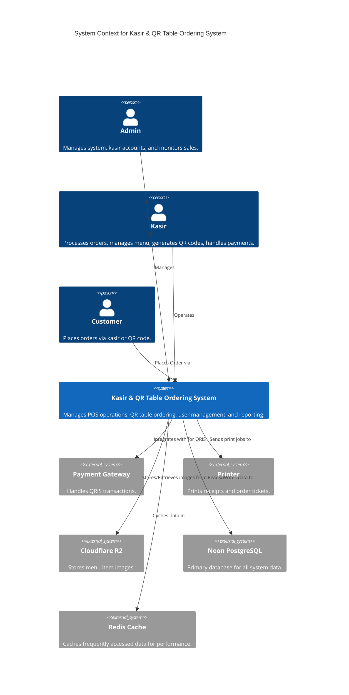

# Struktur Proyek, Workflow, dan Navigasi & Fitur Dashboard - Sistem Kasir & QR Table Ordering

## 1. Struktur Proyek

Struktur proyek akan mengikuti konvensi Next.js, dengan penekanan pada modularitas dan pemisahan tanggung jawab. Penggunaan TypeScript akan memastikan tipe yang kuat dan kode yang lebih mudah dipelihara. Tailwind CSS dan Shadcn UI akan digunakan untuk styling dan komponen UI.

```
kasir-qr-pos/
├── public/
│   └── qrcodes/ # Untuk menyimpan QR Code yang dihasilkan
├── src/
│   ├── app/
│   │   ├── (auth)/
│   │   │   ├── login/
│   │   │   └── register/
│   │   ├── (admin)/
│   │   │   ├── dashboard/
│   │   │   ├── kasir/
│   │   │   ├── laporan/
│   │   │   └── settings/
│   │   ├── (cashier)/
│   │   │   ├── overview/ # Ringkasan bulanan kasir
│   │   │   ├── orders/
│   │   │   ├── menu/
│   │   │   ├── qr-table/
│   │   │   └── settings/
│   │   ├── pos/ # Halaman khusus POS (Full Screen)
│   │   │   └── page.tsx
│   │   ├── (customer)/
│   │   │   ├── [tableId]/
│   │   │   │   ├── page.tsx
│   │   │   │   └── order/
│   │   │   │       └── page.tsx
│   │   ├── api/
│   │   │   ├── auth/
│   │   │   ├── orders/
│   │   │   ├── menu/
│   │   │   └── ...
│   │   ├── layout.tsx
│   │   └── page.tsx
│   ├── components/
│   │   ├── ui/ # Komponen Shadcn UI
│   │   ├── auth/
│   │   ├── common/
│   │   └── dashboard/
│   ├── lib/
│   │   ├── auth.ts # Konfigurasi Better Auth
│   │   ├── db.ts # Konfigurasi Prisma
│   │   ├── redis.ts # Konfigurasi Redis
│   │   ├── utils.ts
│   │   └── hooks/
│   ├── types/
│   │   └── index.d.ts
│   ├── styles/
│   │   └── globals.css
│   └── middleware.ts
├── prisma/
│   ├── schema.prisma
│   └── seed.ts
├── .env
├── next.config.js
├── package.json
├── tsconfig.json
└── README.md
```

## 2. Workflow Sistem

Berikut adalah alur kerja utama dalam sistem:

### 2.1. Alur Kerja Admin

1.  **Login**: Admin masuk ke sistem menggunakan kredensial.
2.  **Manajemen Kasir**: Admin membuat akun kasir baru, mengedit informasi kasir yang ada, atau menonaktifkan akun.
3.  **Monitoring Omset**: Admin melihat laporan penjualan dan omset secara real-time atau berdasarkan periode tertentu.
4.  **Analisis Laporan**: Admin menganalisis data penjualan untuk membuat keputusan bisnis.

### 2.2. Alur Kerja Kasir

1.  **Login**: Kasir masuk ke sistem menggunakan kredensial.
2.  **Manajemen Menu**: Kasir menambah, mengedit, atau menghapus item menu dan kategori.
3.  **Generate QR Table**: Kasir menghasilkan QR Code unik untuk setiap meja dan mencetaknya.
4.  **Pemesanan Langsung**: Kasir menerima pesanan dari pelanggan secara langsung, menginput ke sistem POS, memproses pembayaran (tunai/QRIS), dan mencetak struk.
5.  **Penerimaan Pesanan QR**: Kasir menerima notifikasi pesanan baru dari QR Code Table, melihat detail pesanan, mengkonfirmasi, dan memprosesnya.
6.  **Riwayat Pesanan**: Kasir melihat riwayat pesanan yang telah diproses.
7.  **Pengaturan**: Kasir mengelola pengaturan toko, pajak, dan printer.

### 2.3. Alur Kerja Pelanggan (QR Table Ordering)

1.  **Scan QR Code**: Pelanggan memindai QR Code di meja menggunakan smartphone mereka.
2.  **Lihat Menu**: Pelanggan diarahkan ke halaman menu digital yang menampilkan daftar item, deskripsi, harga, dan gambar.
3.  **Pilih Pesanan**: Pelanggan memilih item menu dan menyesuaikan kuantitas.
4.  **Konfirmasi Pesanan**: Pelanggan melihat ringkasan pesanan, mengisi nama dan nomor telepon, memilih metode pembayaran (tunai/QRIS), dan mengkonfirmasi pesanan.
5.  **Pesanan Terkirim**: Pesanan dikirim ke dasbor Kasir untuk diproses.

## 3. Use Case Diagram



## 4. Navigasi & Fitur Setiap Dashboard

### 4.1. Dashboard Admin

Dashboard Admin dirancang untuk memberikan kontrol penuh atas operasional sistem dan pemantauan kinerja bisnis.

| Menu Navigasi | Fitur Utama                                     | Deskripsi                                                                 |
| :------------ | :---------------------------------------------- | :------------------------------------------------------------------------ |
| **Dashboard** | Ringkasan Omset, Penjualan Harian/Mingguan/Bulanan | Menampilkan grafik dan statistik penjualan secara keseluruhan.            |
| **Kasir**     | Manajemen Akun Kasir                            | Membuat, mengedit, menghapus, dan melihat daftar akun kasir.              |
| **Laporan**   | Laporan Penjualan Detail, Kinerja Kasir         | Melihat laporan penjualan berdasarkan item, waktu, kasir, dan metode pembayaran. |
| **Pengaturan**| Pengaturan Sistem Umum                          | Mengelola konfigurasi aplikasi, seperti nama toko, alamat, dll.           |

### 4.2. Dashboard Kasir

Dashboard Kasir adalah pusat operasional harian untuk memproses pesanan dan mengelola menu.

| Menu Navigasi     | Fitur Utama                                     | Deskripsi                                                                 |
| :---------------- | :---------------------------------------------- | :------------------------------------------------------------------------ |
| **Overview**      | Ringkasan Bulanan, Statistik Penjualan          | Melihat ringkasan omset dan jumlah transaksi kasir dalam 1 bulan terakhir. |
| **POS**           | Halaman Khusus POS (Point of Sale)              | Halaman khusus dengan antarmuka penuh untuk menginput pesanan langsung, diskon, dan pembayaran. |
| **Pesanan**       | Riwayat Pesanan, Penerimaan Pesanan QR          | Melihat daftar pesanan yang sedang berjalan dan yang sudah selesai, serta menerima notifikasi pesanan dari QR Table. |
| **Menu**          | Kelola Kategori & Item Menu                     | Menambah, mengedit, dan menghapus kategori menu serta item menu (nama, harga, deskripsi, gambar). |
| **QR Table**      | Generate & Cetak QR Code Meja                   | Membuat QR Code unik untuk setiap meja dan mencetaknya untuk ditempatkan di meja. |
| **Pengaturan**    | Pengaturan Toko, Pajak, Printer                 | Mengelola informasi toko, tarif pajak, dan konfigurasi printer struk.     |

### 4.3. Antarmuka Pelanggan (QR Table Ordering)

Antarmuka ini adalah aplikasi web sederhana yang diakses pelanggan melalui pemindaian QR Code.

| Bagian Antarmuka | Fitur Utama                                     | Deskripsi                                                                 |
| :--------------- | :---------------------------------------------- | :------------------------------------------------------------------------ |
| **Menu**         | Tampilan Menu Digital                           | Menampilkan daftar menu dengan gambar, deskripsi, dan harga.              |
| **Keranjang**    | Tambah/Kurangi Item, Total Pesanan              | Memungkinkan pelanggan memilih item, menyesuaikan kuantitas, dan melihat total pesanan. |
| **Checkout**     | Input Data Diri, Pilih Metode Pembayaran        | Pelanggan mengisi nama dan nomor telepon, lalu memilih pembayaran (Tunai/QRIS) sebelum konfirmasi pesanan. |
